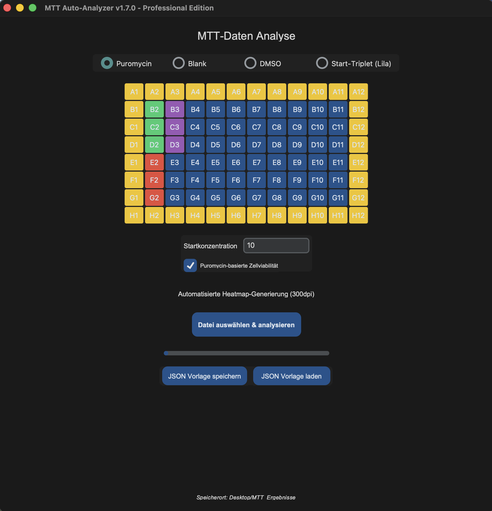

# MTT Assay Automation Pipeline

[](https://opensource.org/licenses/MIT)
[](https://www.python.org/)

An automated Python pipeline designed to parse, analyze, and visualize MTT assay raw data exported from **Molecular Devices SpectraMax 250** microplate readers (*SoftMax Pro 3.0*).

---

## User Interface & Output Preview

<div align="center">
  
  <p><i>Modern Tkinter GUI for interactive control setup and analysis execution.</i></p>
</div>

### Automated Outputs

* **PDF Executive Summary:** Automated generation of a multi-page analytical report containing 4-Parameter-Logistic (4PL) Dose-Response fits, $Z'$-factor calculation, and full 96-well heatmap visualization.
* **Structured Data Export:** Exports raw ODs into a standardized **JSON** formats for seamless pipeline blender (3D-Modelling) integration.

---

## Key Features & Highlights

* **Automated Data Processing:** Eliminates manual Excel copy-pasting by directly parsing `.txt` exports from SoftMax Pro 3.0.
* **Publication-Ready Visualizations:** Transforms raw absorbance data into clean 96-well heatmaps and 4PL dose-response curves.
* **Integrated Quality Control (QC):** Automatically validates internal controls (e.g., Z'-Prime validation and Puromycin control thresholds).
* **Flexible Preset Management:** Save and load custom plate layout configurations via `.json` templates directly within the GUI.
* **Consistent Data Scaling:** Applies standardized color scaling across plates for reliable inter-plate comparisons.

---

## Tech Stack

* **Language:** Python 3.10+
* **Data Processing & Analysis:** Pandas, NumPy, SciPy (4PL Curve Fitting)
* **Visualization:** Seaborn, Matplotlib
* **GUI Framework:** CustomTkinter

---

## Installation & Setup

### Prerequisites
Ensure Python 3 is installed on your machine. 

### macOS / Linux

1. **Clone the repository:**
   ```bash
   git clone [https://github.com/your-username/MTT-Assay-Automation.git](https://github.com/your-username/MTT-Assay-Automation.git)
   cd MTT-Assay-Automation

2. **Install required dependencies:**

   ```bash
   pip3 install pandas seaborn matplotlib numpy scipy reportlab

3. **Launch the Application:**

   ```Bash
   python3 main_gui.py

---

## How to Use

1. Launch the application via main_gui.py.
2. Define control layout or load a pre-saved .json template.
3. Click Datei auswählen & analysieren to upload .txt raw files.
4. Processed PDF summaries and raw JSON datasets will automatically save to Desktop/MTT Ergebnisse.

## License
Distributed under the MIT License. See LICENSE for more information.
